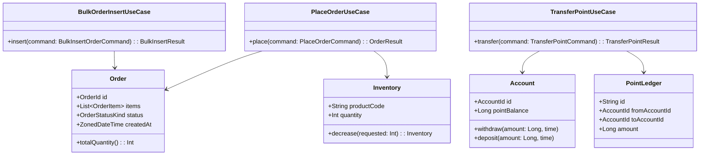
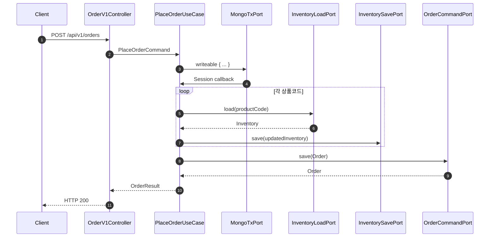
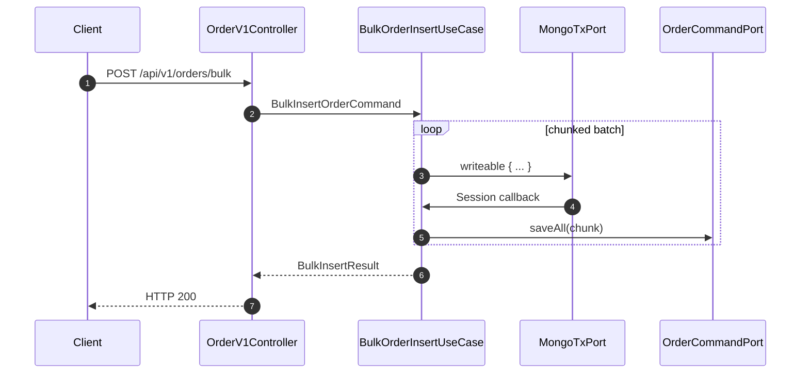
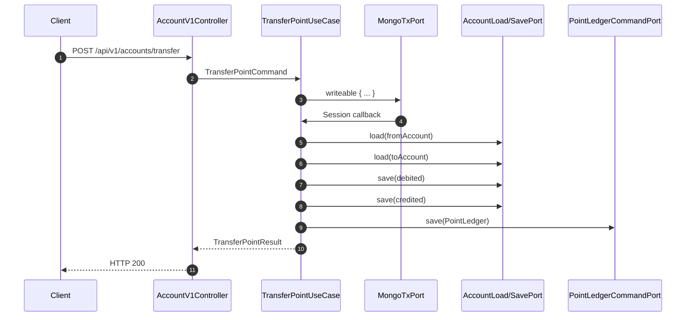

# 다이어그램

## 클래스 다이어그램

```mermaid
classDiagram
    class PlaceOrderUseCase {
        +place(command: PlaceOrderCommand): OrderResult
    }
    class TransferPointUseCase {
        +transfer(command: TransferPointCommand): TransferPointResult
    }
    class BulkOrderInsertUseCase {
        +insert(command: BulkInsertOrderCommand): BulkInsertResult
    }
    class Order {
        +OrderId id
        +List~OrderItem~ items
        +OrderStatusKind status
        +ZonedDateTime createdAt
        +totalQuantity(): Int
    }
    class Inventory {
        +String productCode
        +Int quantity
        +decrease(requested: Int): Inventory
    }
    class Account {
        +AccountId id
        +Long pointBalance
        +withdraw(amount: Long, time)
        +deposit(amount: Long, time)
    }
    class PointLedger {
        +String id
        +AccountId fromAccountId
        +AccountId toAccountId
        +Long amount
    }
    PlaceOrderUseCase --> Order
    PlaceOrderUseCase --> Inventory
    TransferPointUseCase --> Account
    TransferPointUseCase --> PointLedger
    BulkOrderInsertUseCase --> Order
```

## 주문 생성 시퀀스

```mermaid
sequenceDiagram
    autonumber
    participant Client
    participant OrderController as OrderV1Controller
    participant PlaceOrderUC as PlaceOrderUseCase
    participant MongoTx as MongoTxPort
    participant InvLoad as InventoryLoadPort
    participant InvSave as InventorySavePort
    participant OrderPort as OrderCommandPort

    Client->>OrderController: POST /api/v1/orders
    OrderController->>PlaceOrderUC: PlaceOrderCommand
    PlaceOrderUC->>MongoTx: writeable { ... }
    MongoTx->>PlaceOrderUC: Session callback
    loop 각 상품코드
        PlaceOrderUC->>InvLoad: load(productCode)
        InvLoad-->>PlaceOrderUC: Inventory
        PlaceOrderUC->>InvSave: save(updatedInventory)
    end
    PlaceOrderUC->>OrderPort: save(Order)
    OrderPort-->>PlaceOrderUC: Order
    PlaceOrderUC-->>OrderController: OrderResult
    OrderController-->>Client: HTTP 200
```

## 대량 주문 삽입 시퀀스

```mermaid
sequenceDiagram
    autonumber
    participant Client
    participant OrderController as OrderV1Controller
    participant BulkUC as BulkOrderInsertUseCase
    participant MongoTx as MongoTxPort
    participant OrderPort as OrderCommandPort

    Client->>OrderController: POST /api/v1/orders/bulk
    OrderController->>BulkUC: BulkInsertOrderCommand
    loop chunked batch
        BulkUC->>MongoTx: writeable { ... }
        MongoTx->>BulkUC: Session callback
        BulkUC->>OrderPort: saveAll(chunk)
    end
    BulkUC-->>OrderController: BulkInsertResult
    OrderController-->>Client: HTTP 200
```

## 포인트 이체 시퀀스

```mermaid
sequenceDiagram
    autonumber
    participant Client
    participant AccountController as AccountV1Controller
    participant TransferUC as TransferPointUseCase
    participant MongoTx as MongoTxPort
    participant AccountPort as AccountLoad/SavePort
    participant LedgerPort as PointLedgerCommandPort

    Client->>AccountController: POST /api/v1/accounts/transfer
    AccountController->>TransferUC: TransferPointCommand
    TransferUC->>MongoTx: writeable { ... }
    MongoTx->>TransferUC: Session callback
    TransferUC->>AccountPort: load(fromAccount)
    TransferUC->>AccountPort: load(toAccount)
    TransferUC->>AccountPort: save(debited)
    TransferUC->>AccountPort: save(credited)
    TransferUC->>LedgerPort: save(PointLedger)
    TransferUC-->>AccountController: TransferPointResult
    AccountController-->>Client: HTTP 200
```
